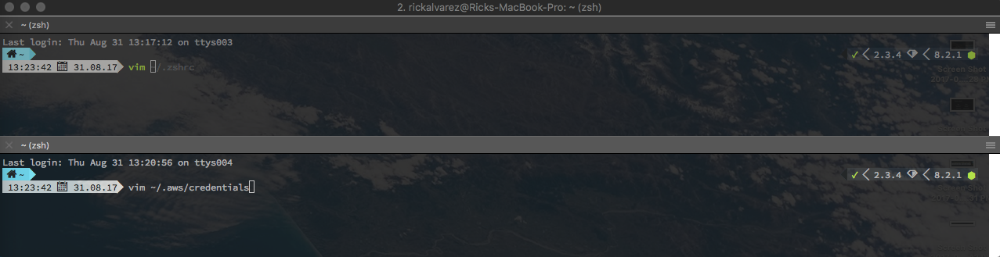
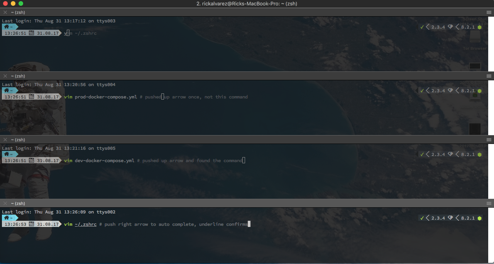
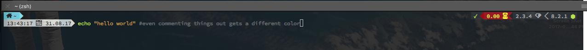

# ZSH
The UNIX shell is most people's main access to the UNIX operating
system and as such any improvement to it can result in considerably
more effective use of the system, and may even allow you to do things
you couldn't do before. The primary improvement most of the new
generation shells give you is increased speed. They require fewer key
strokes to get the same results due to their completion features, they
give you more information (e.g. showing your directory in your prompt,
showing which files it would complete) and they cover some of the more
annoying features of UNIX, such as not going back up symbolic links to
directories.
```shell
                                    sh   csh  ksh  bash tcsh zsh  rc   es
Job control                          N    Y    Y    Y    Y    Y    N    N
Aliases                              N    Y    Y    Y    Y    Y    N    N
Shell functions                      Y(1) N    Y    Y    N    Y    Y    Y
"Sensible" Input/Output redirection  Y    N    Y    Y    N    Y    Y    Y
Directory stack                      N    Y    Y    Y    Y    Y    F    F
Command history                      N    Y    Y    Y    Y    Y    L    L
Command line editing                 N    N    Y    Y    Y    Y    L    L
Vi Command line editing              N    N    Y    Y    Y(3) Y    L    L
Emacs Command line editing           N    N    Y    Y    Y    Y    L    L
Rebindable Command line editing      N    N    N    Y    Y    Y    L    L
User name look up                    N    Y    Y    Y    Y    Y    L    L
Login/Logout watching                N    N    N    N    Y    Y    F    F
Filename completion                  N    Y(1) Y    Y    Y    Y    L    L
Username completion                  N    Y(2) Y    Y    Y    Y    L    L
Hostname completion                  N    Y(2) Y    Y    Y    Y    L    L
History completion                   N    N    N    Y    Y    Y    L    L
Fully programmable Completion        N    N    N    N    Y    Y    N    N
Mh Mailbox completion                N    N    N    N(4) N(6) N(6) N    N
Co Processes                         N    N    Y    N    N    Y    N    N
Builtin artithmetic evaluation       N    Y    Y    Y    Y    Y    N    N
Can follow symbolic links invisibly  N    N    Y    Y    Y    Y    N    N
Periodic command execution           N    N    N    N    Y    Y    N    N
Custom Prompt (easily)               N    N    Y    Y    Y    Y    Y    Y
Sun Keyboard Hack                    N    N    N    N    N    Y    N    N
Spelling Correction                  N    N    N    N    Y    Y    N    N
Process Substitution                 N    N    N    Y(2) N    Y    Y    Y
Underlying Syntax                    sh   csh  sh   sh   csh  sh   rc   rc
Freely Available                     N    N    N(5) Y    Y    Y    Y    Y
Checks Mailbox                       N    Y    Y    Y    Y    Y    F    F
Tty Sanity Checking                  N    N    N    N    Y    Y    N    N
Can cope with large argument lists   Y    N    Y    Y    Y    Y    Y    Y
Has non-interactive startup file     N    Y    Y(7) Y(7) Y    Y    N    N
Has non-login startup file           N    Y    Y(7) Y    Y    Y    N    N
Can avoid user startup files         N    Y    N    Y    N    Y    Y    Y
Can specify startup file             N    N    Y    Y    N    N    N    N
Low level command redefinition       N    N    N    N    N    N    N    Y
Has anonymous functions              N    N    N    N    N    N    Y    Y
List Variables                       N    Y    Y    N    Y    Y    Y    Y
Full signal trap handling            Y    N    Y    Y    N    Y    Y    Y
File no clobber ability              N    Y    Y    Y    Y    Y    N    F
Local variables                      N    N    Y    Y    N    Y    Y    Y
Lexically scoped variables           N    N    N    N    N    N    N    Y
Exceptions                           N    N    N    N    N    N    N    Y
```

# OHMYZSH
Oh My Zsh is an open source, community-driven framework for managing your zsh configuration.

Sounds boring. Let's try again.

Oh My Zsh will not make you a 10x developer...but you might feel like one.
[Oh My Zsh](https://github.com/robbyrussell/oh-my-zsh)

## Basic Installation

Oh My Zsh is installed by running one of the following commands in your terminal. You can install this via the command-line with either curl or wget.

via curl
```shell
sh -c "$(curl -fsSL https://raw.githubusercontent.com/robbyrussell/oh-my-zsh/master/tools/install.sh)"
```
via wget
```shell
sh -c "$(wget https://raw.githubusercontent.com/robbyrussell/oh-my-zsh/master/tools/install.sh -O -)"
```

# ZGEN
[ZGEN](https://github.com/tarjoilija/zgen) helps with managing the plugins which extend the functionality of your shell. My favorite plugins:

### VCS / GIT
This module helps with prompting a user with the status of the repo they are currently in. The color will change from green to orange if the repo is out of sync and an arrow point down with a number representing how many commits it is behind will appear. If the branch is up to date the bar will appear green. If the repo is up to date and is ahead of the master branch the bar will appear green with an up arrow and a number indicating how many commits it is ahead by. A question mark indicates a file is not being tracked. There is so much more, you really need to rtfm on this one.
[readme for the readme](https://github.com/bhilburn/powerlevel9k)

By default, the `vcs` segment will provide quite a bit of information. Further
customization is provided via:

| Variable | Default Value | Description |
|----------|---------------|-------------|
|`POWERLEVEL9K_HIDE_BRANCH_ICON`|`false`|Set to `true` to hide the branch icon from the segment.|
|`POWERLEVEL9K_SHOW_CHANGESET`|`false`|Set to `true` to display the hash / changeset in the segment.|
|`POWERLEVEL9K_CHANGESET_HASH_LENGTH`|`12`|How many characters of the hash / changeset to display in the segment.|
|`POWERLEVEL9K_VCS_SHOW_SUBMODULE_DIRTY`|`true`|Set to `false` to not reflect submodule status in the top-level repository prompt.|
|`POWERLEVEL9K_VCS_HIDE_TAGS`|`false`|Set to `true` to stop tags being displayed in the segment.|


##### vcs symbols

The `vcs` segment uses various symbols to tell you the state of your repository.
These symbols depend on your installed font and selected `POWERLEVEL9K_MODE`
from the [Installation](#Installation) section above.

| `Compatible` | `Powerline` | `Awesome Powerline` | Explanation
|--------------|---------------------|-------------------|--------------------------
| `↑4`         | `↑4`                | 4  | Number of commits your repository is ahead of your remote branch
| `↓5`         | `↓5`                | 5  | Number of commits your repository is behind of your remote branch
| `⍟3`         | `⍟3`                | 3 | Number of stashes, here 3.
| `●`          | `●`                 |  | There are unstaged changes in your working copy
| `✚`          | `✚`                 |  | There are staged changes in your working copy
| `?`          | `?`                 |   | There are files in your working copy, that are unknown to your repository
| `→`          | `→`                 |  | The name of your branch differs from its tracking branch.
| `☿`          | `☿`                 |  | A mercurial bookmark is active.
| `@`         |  |  | Branch Icon
| None         |  None               | 2c3705 | The current commit hash. Here "2c3705"
| None         |  None               |  | Repository is a git repository
| None         |  None               |  | Repository is a Mercurial repository


### history-substring-search
Allows you history to be used as a reference when typing commands. The history will display in grey text and you can push up to cycle through the previous commands. Typing vim and pressing up arrow will allow you to cycle through all the previous iterations of your vim command.



### completion
Once you find the command you are looking for using the history-substring-search you can use completion to auto complete the string using right arrow. Below is a screen shot of cycling through a vim command and auto completing it.



### syntax-highlighting
Your commands get syntax-highlight while you are typing them out, this does not include the green on the command being typed.



### Awesome Fonts
Allows you to see symbols in your command terminal so you can deduct more from less

### Tab Autocomplete
Tab to auto complete commands, it will search directories, branches, commits, and other things.


#PowerLevel9K
Theming for zsh comes in many different flavors. I've been using PowerLevel9K on my work laptop for a couple weeks now. You can customize what languages pop up in the display, how the git


# Tile Management and Window Placement
Using [Amethyst](https://github.com/ianyh/Amethyst) you can have windows auto resize and give you different views for efficiently handling multiple windows.

# Hot Keys
Some commonly used hot keys.

### Atom
These hot keys work mainly in Atom but some of them transfer nicely over to Sublime3 as well:

Duplicate line
```
cmd + shift + d
```

Select the next variance of highlighted text.
*Highlight a variable*
```
cmd + d *repeat for as many instances you want to manipulate*
```

Multi Line Manipulations
*Highlight everything*
```
cmd + shift + l *Adds curser to every line*
cmd + left or right arrow *Go to the back or front of all the lines, take action*
```

Hide Left Panel for Directory listing
```
cmd + \
```

Mark Down Preview
```
ctrl + shift + m
```

### Terminal
Hot keys for iTerm2. (nightly because dark themes)
New Tile Horizontal
```
cmd + d
```

New Tile Vertical
```
cmd + shift + d
```

Move Around Tiles
```
cmd + option *arrow key in the direction of the tile you want*
```

Resize Tiles
```
cmd + ctrl *arrow in the direction you would like to move the boarder*
```

Shell Transparency
```
cmd + u = transparency
```
